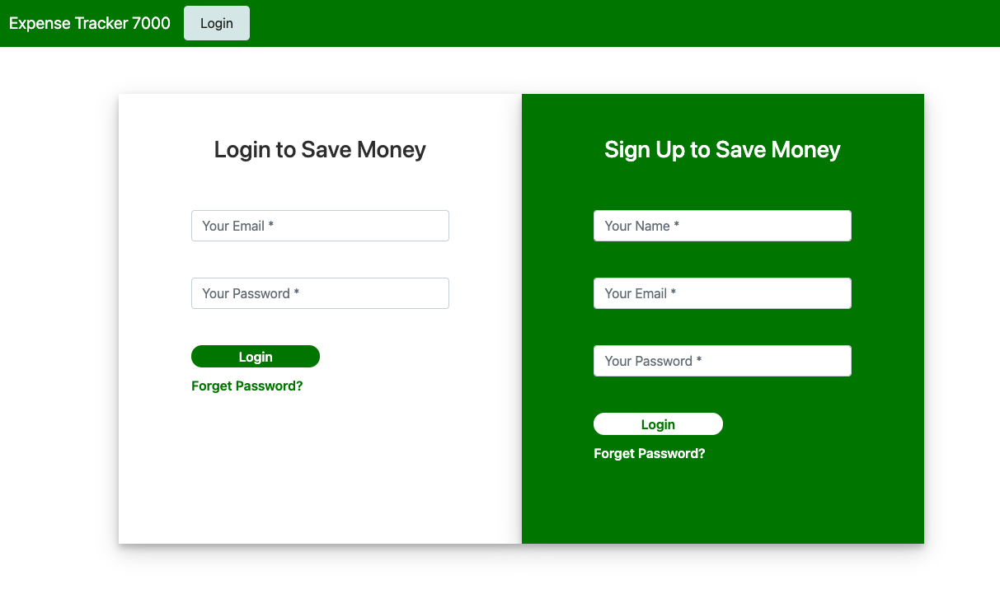
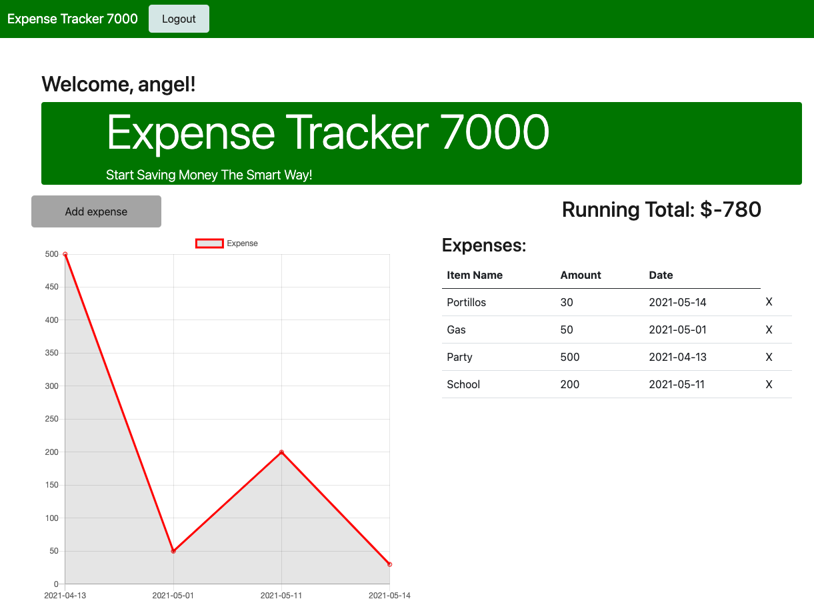
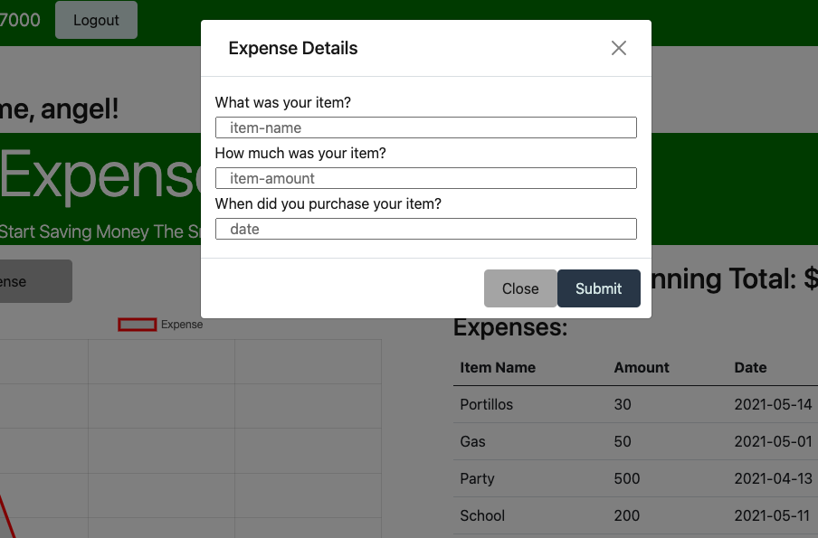

# Expense Tracker 7000 
## Table of Contents
  * [Description](#description)
  * [Technologies](#technologies)
  * [Story](#story)
  * [Demo](#demo)
  * [Deployment](#deployment)
  * [Contributions](#contributions)
## Description
    The Expense Tracker 7000 is a full stack application that was created to 
    help the average person track money. Simply log in to start tracking and
    saving! 
## Technologies
    We built this application with Node.js, Express.js for the API, 
    Chart.js for a visual representation of the data
    Handlebars as the template engine and MySQL, Sequelize for the database.
## Story
    - User arrives on the landing page.
    - If the user has an account they can log in using the login form.
    - If the user does not have an account they are able to create one by using 
      the signup form.
    - Once the user is logged in, the user is taken to the money tracking page.
    - The user can now add an expense by clicking on the expense button.
    - A form will now appear where the user can input a simple form with
      item name, item amount and item date.
    - The user can now click submit and they will see their expenses reflected
      on the graph and details of the expenses as well. 
    - Log out and see you next time!
## Demo

## License

## Deployment
[Expense Tracker 7000](https://expense-tracker-7000.herokuapp.com/)
This app is deployed live on Heroku! (Click Link!)
## Contributions
[Levi Kane](https://github.com/levickane)

[Zachary Taylor](https://github.com/taylor67469)

[Angel Flores](https://github.com/angelfloreschicago)

[Mark Drecoll](https://github.com/markdrecoll)